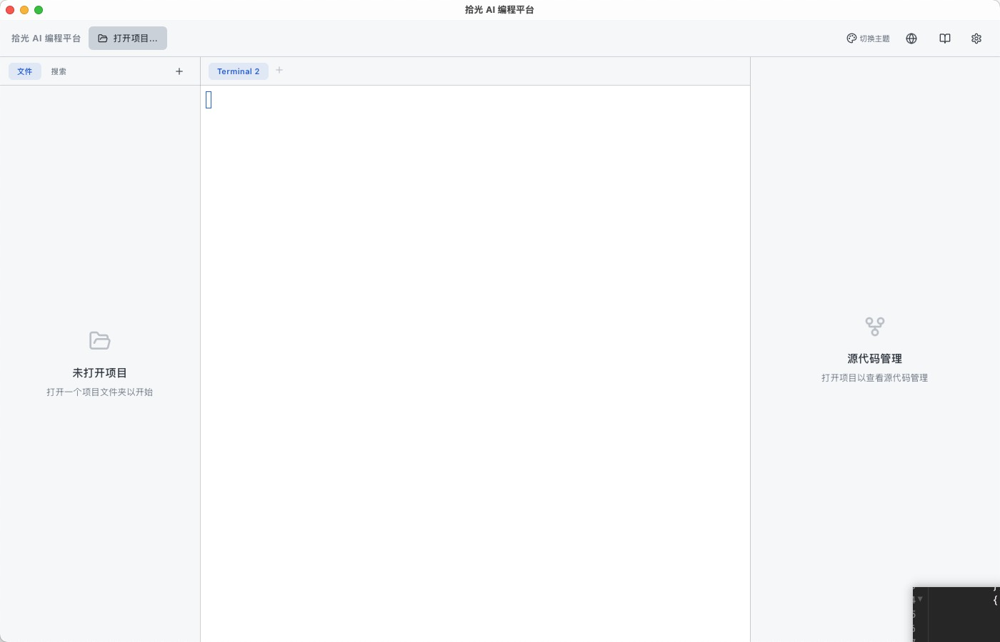
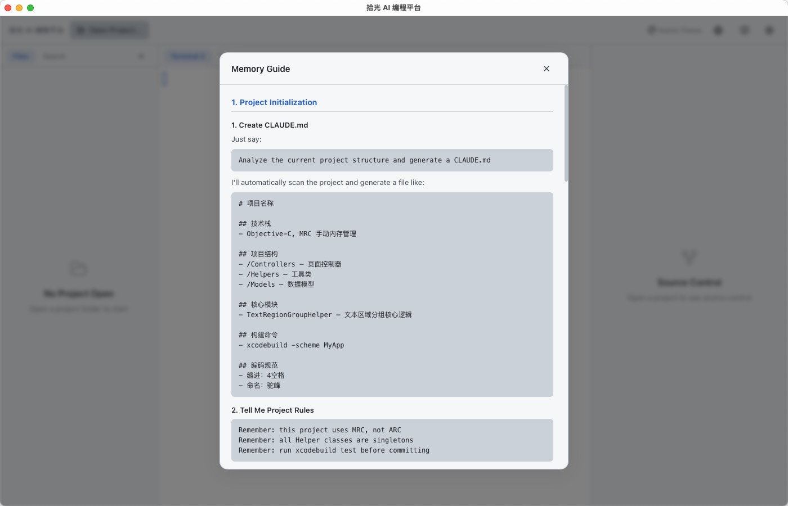
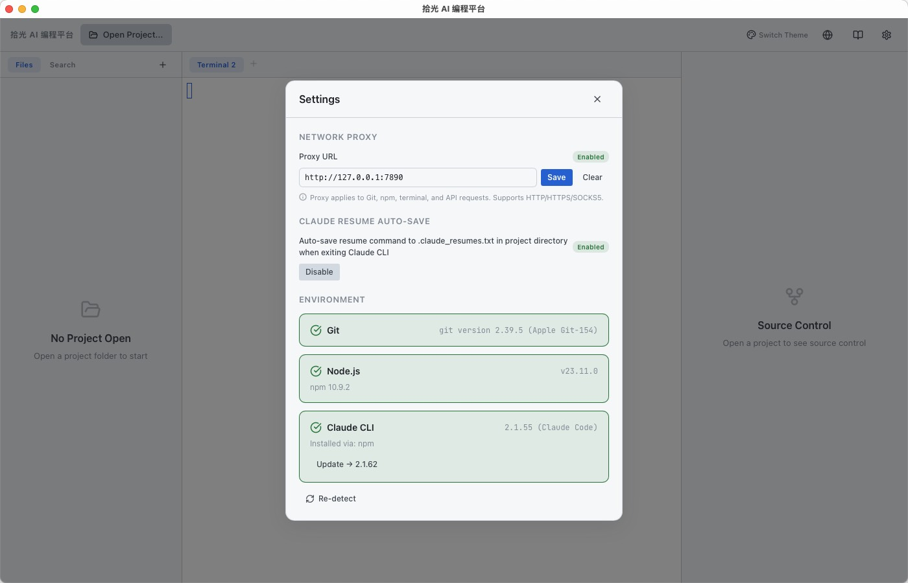

English | [中文](README.zh-CN.md)

# ShiGuang AI Coding Platform

A desktop coding assistant integrating AI chat, Git workflow, and terminal, built with Tauri 2. Supports macOS, Windows, and Linux.

## Features

- **AI Chat (In Development)** — Anthropic Claude and OpenAI provider interfaces remain available; terminal-based coding uses OMP or Pi
- **Git Integration** — File-level staging/unstaging, commit, push/pull, branch tracking, commit log, diff preview
- **Built-in Terminal** — Multi-tab terminal supporting zsh/bash/fish/PowerShell with custom prompt and full keyboard shortcut support; bounded output flow control preserves ordered ANSI data in hidden tabs
- **File Management** — Project file tree browsing, search, create/rename/delete
- **File Editing** — CodeMirror editing with undo-aware saved snapshots; large files use a lightweight mode that retains editing, search, undo and save
- **Environment Checks** — Local tool detection is independent of background update checks, with shared requests and subprocess deadlines
- **Network Proxy** — HTTP/HTTPS/SOCKS5 proxy support, one-click apply to Git, npm, terminal, and API requests
- **Coding CLI Sessions** — OMP by default, remembered CLI selection, and New / Continue / Choose session actions; approval controls follow each CLI's capabilities
- **Multiple Themes** — 14 built-in themes (Catppuccin Mocha/Latte, Dracula, Nord, Tokyo Night, etc.)
- **Bilingual UI** — Switch between Chinese and English with one click
- **Secure Storage** — In-app provider API keys use the system keychain; OMP and Pi retain their own authentication and model configuration

## Coding CLI workflow

- Choose OMP or Pi in the terminal toolbar or settings. The selection persists independently of the AI provider/model settings; Claude models remain supported.
- The three actions use the current terminal pane's working directory. Busy or unverifiable terminals reject launches rather than injecting commands into a running TUI.
- **New** always starts fresh. For OMP, a temporary per-run `autoResume: false` overlay prevents a global auto-resume preference from changing this action; the user's configuration is not rewritten.
- **Continue** uses `--continue`; **Choose session** opens the CLI's `--resume` picker. Histories remain managed separately by each CLI.
- OMP offers Follow configuration, Ask every time, and Auto-approve all tools. The last option includes command execution and requires explicit confirmation. Pi has no equivalent selector; its `--approve` flag is project trust, not per-tool approval.
- Commit-message generation uses the selected CLI in ephemeral, tool-free print mode. It produces text only and does not run `omp commit` or create a Git commit.
- Existing Claude Code files, shell configuration, credentials and histories are left untouched. The old app-managed resume hook and command installer are no longer active.

## Screenshots

These images show an earlier UI; the current CLI controls are described above.

| Main Interface | Memory Guide | Settings |
|:-:|:-:|:-:|
|  |  |  |

## Tech Stack

| Layer | Technology |
|-------|------------|
| Framework | [Tauri 2](https://v2.tauri.app/) |
| Frontend | React 19 + TypeScript + Vite |
| State Management | Zustand |
| Backend | Rust |
| Database | SQLite (rusqlite) |
| Git | libgit2 (git2-rs) |
| Terminal | portable-pty + xterm.js |
| HTTP | reqwest (with SOCKS5 support) |
| Key Storage | keyring (macOS Keychain / Linux Secret Service) |

## Prerequisites

- **Node.js** >= 18
- **Rust** >= 1.70
- **System Dependencies**
  - macOS: Xcode Command Line Tools
  - Windows: [WebView2](https://developer.microsoft.com/en-us/microsoft-edge/webview2/), Visual Studio Build Tools
  - Linux: `libwebkit2gtk-4.1-dev libgtk-3-dev libappindicator3-dev librsvg2-dev patchelf`
- **Coding CLI runtime** — Native OMP needs neither Node.js nor Bun. Its Bun installation channel needs Bun >= 1.3.14; Pi's npm package needs Node.js >= 22.19.0 and npm.

## Quick Start

```bash
# Clone the repository
git clone https://github.com/carppond/fc-ai-coding-workbench.git
cd fc-ai-coding-workbench

# Install frontend dependencies
npm install

# Run in development mode
cargo tauri dev

# Build for production (current platform)
cargo tauri build
```

### macOS Packaging

```bash
# Current architecture
cargo tauri build

# Universal Binary (Intel + Apple Silicon)
cargo tauri build --target universal-apple-darwin
```

You can also use the provided build script:

```bash
chmod +x build-dmg.sh
./build-dmg.sh          # Current architecture
./build-dmg.sh universal # Universal Binary
```

## Project Structure

```
├── src/                    # Frontend (React + TypeScript)
│   ├── components/         # UI Components
│   │   ├── layout/         # Layout (TopBar, AppShell)
│   │   ├── left-panel/     # File tree, session list
│   │   ├── center-panel/   # Terminal, file preview
│   │   └── right-panel/    # Git operations panel
│   ├── stores/             # Zustand state management
│   ├── ipc/                # Tauri IPC command bindings
│   ├── lib/                # Utilities (i18n, type definitions)
│   └── styles/             # CSS styles
├── src-tauri/              # Backend (Rust)
│   ├── src/
│   │   ├── commands/       # Tauri command handlers
│   │   ├── db/             # SQLite database layer
│   │   ├── git/            # Git operations
│   │   ├── terminal/       # Terminal PTY management
│   │   ├── providers/      # AI providers (Anthropic, OpenAI)
│   │   ├── proxy.rs        # Network proxy management
│   │   └── state.rs        # Application state
│   ├── Cargo.toml
│   └── tauri.conf.json
├── .github/workflows/      # CI/CD (GitHub Actions, 3-platform build)
├── package.json
└── vite.config.ts
```

## CI/CD

The project includes GitHub Actions for automated builds:

- **Manual Trigger** — Actions → `Build & Release` → `Run workflow`
- **Tag Trigger** — Push a `v*` tag to automatically build and create a GitHub Release

Build Artifacts:

| Platform | Format |
|----------|--------|
| macOS | `.dmg` (Universal Binary) |
| Windows | `.msi` + `.exe` |
| Linux | `.deb` + `.AppImage` |

## Notes

1. **API Key Security** — In-app provider keys remain in the system keychain. CLI login and model settings belong to OMP/Pi; the app does not copy keys or write shell API variables.
2. **Proxy Settings** — Proxy configuration in the settings panel is persisted to the database and auto-restored on restart
3. **Terminal Environment** — The built-in terminal inherits the system shell environment with a custom prompt; delete the corresponding temp file to restore the original prompt
4. **Git Operations** — To prevent accidental operations, staging automatically filters out `node_modules`, `.git`, `target`, and similar directories
5. **Data Storage** — Application data (database, settings) is stored in the system app data directory:
   - macOS: `~/Library/Application Support/com.shiguang.ai-coding/`
   - Windows: `%APPDATA%/com.shiguang.ai-coding/`
   - Linux: `~/.local/share/com.shiguang.ai-coding/`

## License

[MIT License](LICENSE)

## Contributing

Issues and Pull Requests are welcome.

1. Fork this repository
2. Create a feature branch (`git checkout -b feature/xxx`)
3. Commit your changes (`git commit -m 'Add xxx'`)
4. Push the branch (`git push origin feature/xxx`)
5. Create a Pull Request
